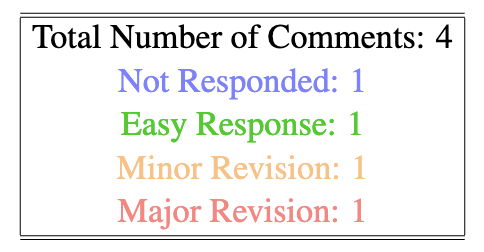

# Rebuttal LaTeX Class

This repository provides a LaTeX class for organizing responses to peer reviews in a color-coded format.

## Features

- Color-coded reviewer comments:
  - Blue: default
  - Green: resolved
  - Orange: pending
  - Red: stuck
- Reviewer-specific equation numbering (e.g., R1.1, R1.2)
- Appends a diff PDF (revised manuscript) to the end
- Summary statistics of comment responses

## Usage

```latex
\documentclass{Classes/rebuttal}
\title{Title of the Paper}
\author{Author Names}
\submissionid{1234}
\diffPDFpath{filename.pdf}     % Path to the diff PDF to be appended
```

### Reviewer Section Header

```latex
% \rebsection{1}: Section for Reviewer 1 with:
% \label{sec:reviewer1}
% equation numbers starting with R1.1
% reset the equation counter to 0
\rebsection{1}
```

### Comment + Response

```latex
\begin{rebuttal}[resolved] % Options: resolved, pending, stuck, (default: blue)
    % Comment
    {%
        Example of a resolved comment: Why did the scarecrow win an award?
    }%
    % Response
    {%
        Because he was outstanding in his field.
    }%
\end{rebuttal}
```
<div align="center">  </div>

### Rebuttal Statistics Summary

```latex
\printStats
```
<div align="center">  </div>

### Append Revised PDF

```latex
\appenddiffPDF
```